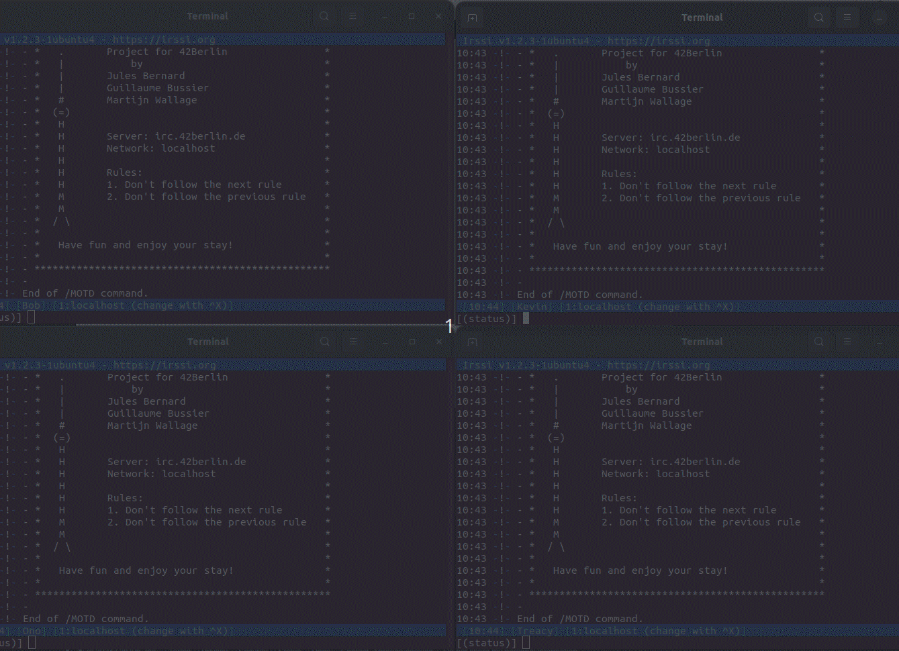
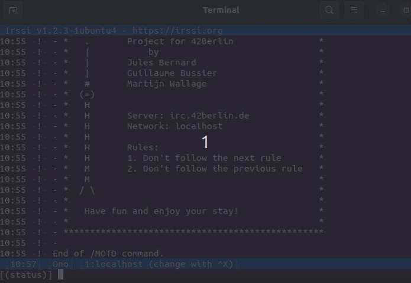
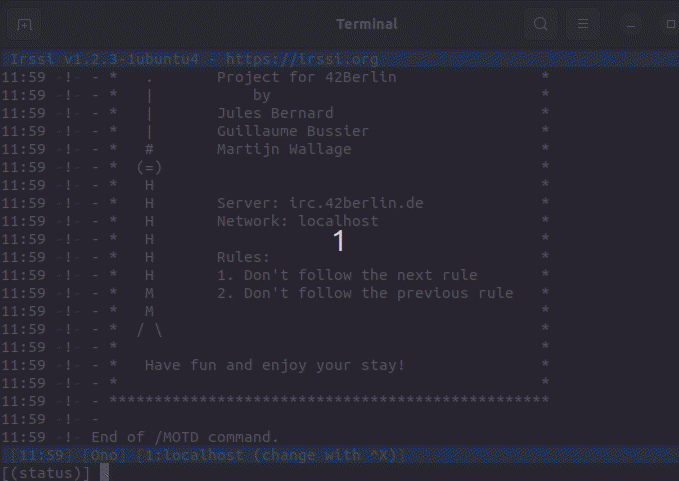

# IRC server


## Table of Contents

1. [Introduction](#introduction)
2. [Features](#features)
3. [Installation](#installation)
4. [Commands](#commands) 
5. [Usage](#usage)
6. [Configuration](#configuration)
7. [Chatbots](#chatbots)
8. [Contributors](#contributors)
9. [Resources](#resources)

## Introduction

Welcome to our IRC (Internet Relay Chat) project! This project aims to implement a functional IRC server and client based on the RFC standard. IRC is a protocol for real-time internet text messaging and is well-suited for group communication in discussion forums, known as channels.

## Features

- **Basic IRC Protocol Support:** Implements core functionalities such as connecting to the server, joining channels, and sending messages.
- **User Authentication:** Supports user registration and login.
- **Channel Management:** Users can create, join, leave, and manage channels.
- **Message Broadcasting:** Supports sending messages to individual users and broadcasting to channels.
- **Private Messaging:** Users can send private messages.
- **Server Administration:** Administrative commands for managing the server and user privileges.

## Installation

### Prerequisites

- C++ Compiler (supporting C++98 or later)
- Make
- Git

### Steps

1. **Clone the repository:**
   ```sh
   git clone https://github.com/yourusername/irc-project.git
   cd irc-project
   ```
2. **Build the project:**
   ```sh
   make
   ```
## Commands

### Server related commands
* PING
* PONG
* QUIT

### User related commands
* USER
* NICK
* PASS
* WHO

### Channel related commands
* INVITE
* JOIN
* KICK
* MODE (t, i, o, l, k)
* PART
* TOPIC

### Messages commands ###
* PRIVMSG


### Usage

### Running the Server

To start the IRC server, execute:
  ```sh
  ./ircserv <port> <password>
 ```
port: The port number on which the server is listening.

password: The password required to connect to the server.

Example:  
```sh
  ./ircserv 6667 pw
 ```

### Runing the client

- The server is designed to work with irssi, to start it execute:
    ```sh
  irssi
    ```
  once in irssi execute:
    ```irssi
    /connect localhost <port> <password>
    ```
    
- Alternatively you can execute the attached shell script which connect automatically 3 different users (recommanded).
  
  ```sh
  ./scriptClient.sh
  ```
- Here is a small demonstration

  

#### Commands on irssi
    /mode: set or remove channel modes:
      - +i: set channel to Invite-only.
      - +t: set the topic to be modifiable by channel operators only.
      - +l <int>: set the user limit to channel
      - +k <password>: set a password for the channel.
      - +o <username>: set a user as channelp operator of the channel.
    /join <#channel>: Join a channel.
    /part <#channel>: Leave a channel.
    /msg <nickname> <message>: Send a private message to a user.
    /quit [reason]: Disconnect from the server.
    /topic <#channel> :<new topic>: change or view the topic of the channel.
    /invite: invite a user to a channel.
    /kick: eject a client from the channel.

## Configuration

The server can be configured using a configuration file named server.conf in the /config folder. 


## Chatbots

We implemented two chatbots

  1. Compile chatbots
     
  ```sh
  make gamebot gptbot
  ```
  2. run the bots in two separate terminals

   ```sh
  ./gamebot <port> <password>
  ./gptbot <port> <password>
  ```

  3. you can start a private conversation with the chatbots using PRIVMSG
     - Gamebot - small game to guess a number.
       
       
       
     - Gptbot: this bot uses an API key, you can add your own key to test it by plugging it in the file botGPT.sh

       

## Contributors
- [Guillaume Bussiere](https://github.com/Bussiereg)
- [Jules Bernard](https://github.com/julesrb)
- [Martijn Wallage](https://github.com/MartijnWallage)

## Resources
- [irssi commands](https://irssi.org/documentation/help/cat_IRC%20Commands)
- [RFC 1459 "Internet Relay Chat Protocol"](https://datatracker.ietf.org/doc/html/rfc1459)
- [RFC 2810: "Internet Relay Chat: Architecture"](https://datatracker.ietf.org/doc/html/rfc2810)
- [RFC 2811: "Internet Relay Chat: Channel Management"](https://datatracker.ietf.org/doc/html/rfc2811)
- [RFC 2812: "Internet Relay Chat: Client Protocol"](https://datatracker.ietf.org/doc/html/rfc2812)
- [RFC 2813: "Internet Relay Chat: Server Protocol"](https://datatracker.ietf.org/doc/html/rfc2813)
